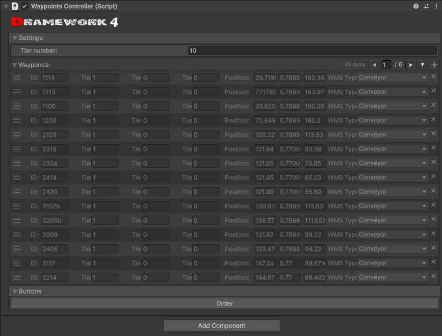
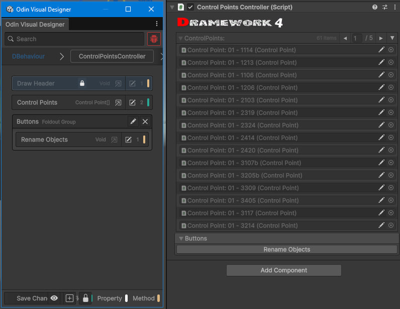
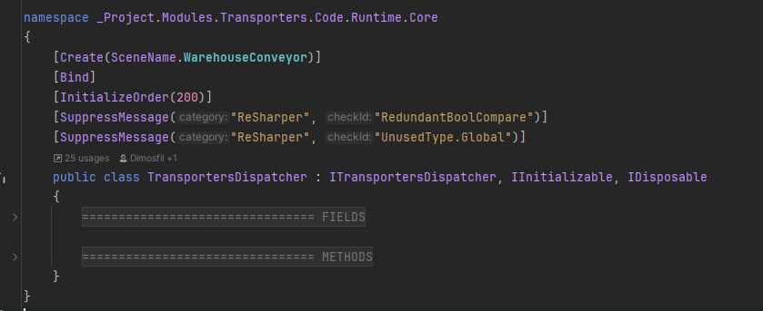
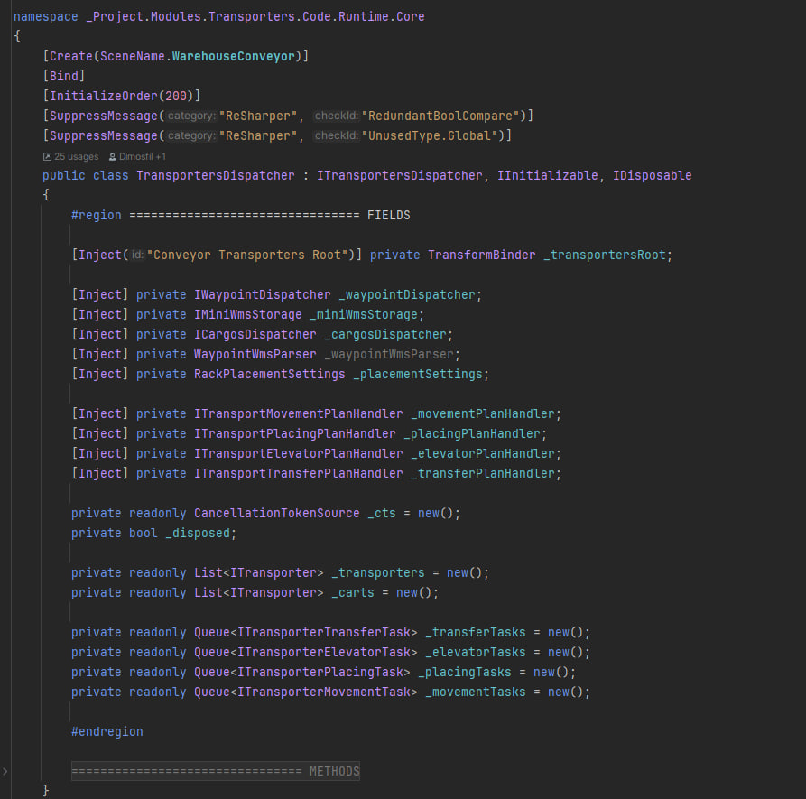

# Dramework4

Dramework4 - runtime-фреймворк/пакет для Unity проектов HappyCoder и Indie
Games Project. Он рассчитан на Unity `2022.3+`, включая актуальные версии
Unity 6. Фреймворк добавляет поверх Unity-сцен прикладной слой:
dependency injection, управляемый жизненный цикл, messaging, Addressables
helpers, storage/config helpers, editor-инструменты и поддержку EditMode-тестов.

## Get Started

1. Скачайте готовый пакет Dramework4 из GitHub Releases этого репозитория.
   Обычно это `.unitypackage`, приложенный к последнему release.
2. Импортируйте пакет в Unity через `Assets > Import Package > Custom Package...`
   и выберите скачанный файл.
3. Убедитесь, что зависимости из раздела `Зависимости` доступны в проекте,
   включая Odin Inspector.
4. После импорта editor initializer создаст служебные папки Dramework4 и
   `App Config` asset в Resources.
5. Добавьте на сцену `SceneContainer`, если сцене нужен DI/lifecycle flow.
   В inspector нажмите `Refresh`, чтобы контейнер нашел `DBehaviour` и
   компоненты с `[Bind]`.
6. Помечайте runtime-сервисы через `[Bind]` или `[Create(sceneName, order)]`,
   а зависимости внедряйте через `[Inject]`.
7. Реализуйте нужные lifecycle interfaces, например `IInitializable`,
   `IStartable` или `IUpdatable`. Порядок вызовов задавайте order-атрибутами.
8. Для событий используйте `DWSignal`/`DWSignalAsync`, для request/response -
   `DWRequest`, для загрузки Addressables - `DW4.AddressablesTools`.

Для локальной разработки пакета можно открыть `Window > Package Manager >
Add package from disk...` и выбрать `Assets/IG/package.json` из checkout этого
репозитория.

## Основной функционал

### Dependency Injection

Фреймворк использует атрибуты и scene containers для регистрации и внедрения
объектов. В runtime этим управляет `Dispatcher`, а для EditMode-тестов есть
публичный `DWTestContainer`.

Поддерживаются:

- `[Bind]` на классах, которые нужно зарегистрировать в контейнере.
- `[Create(sceneName, order)]` на non-MonoBehaviour классах, которые нужно
  создать для сцены.
- `[Inject]` на конструкторах, полях, свойствах и методах.
- `[ID("name")]` для выбора зависимости по идентификатору.
- `[InjectInside]` для внедрения зависимостей во вложенные объекты.
- `IIdentifiable.ID` для идентификаторов объектов и конфигов.
- Внедрение списков и массивов в `DWTestContainer`.

Пример:

```csharp
public interface IWalletService
{
}

[Bind]
public sealed class WalletService : IWalletService
{
}

public sealed class WalletPresenter
{
    [Inject] private IWalletService _walletService;
}
```

### Сцены и жизненный цикл

`Dispatcher` создается автоматически до загрузки сцены. Он регистрирует
`SceneContainer`, создает объекты по атрибутам, внедряет зависимости и запускает
lifecycle-интерфейсы в заданном порядке.

Lifecycle-интерфейсы:

- `IPreInitializable.OnPreInitialize()` - синхронная подготовка перед async
  initialization.
- `IInitializable.OnInitialize(CancellationToken)` - async initialization,
  например загрузка данных, создание runtime state или подготовка сервисов.
- `IStartable.OnStart(CancellationToken)` - async старт после initialization,
  когда зависимости уже созданы и проинициализированы.
- `IEarlyUpdatable.OnEarlyUpdate()` - ранний per-frame update до основного
  update flow.
- `IPreUpdatable.OnPreUpdate()` - подготовительный update перед `OnUpdate`.
- `IUpdatable.OnUpdate()` - основной per-frame update.
- `IFixedUpdatable.OnFixedUpdate()` - fixed-step update для physics-like
  логики.
- `IPreLateUpdatable.OnPreLateUpdate()` - подготовка перед late-update stage.
- `IPostLateUpdatable.OnPostLateUpdate()` - завершающий late-update stage.
- `IPausable.OnPause()` и `IPausable.OnResume()` - реакция объекта на pause и
  resume.

Атрибуты порядка:

- `[InitializeOrder]` - задает порядок вызова `OnInitialize`.
- `[StartOrder]` - задает порядок вызова `OnStart`.
- `[EarlyUpdateOrder]` - задает порядок вызова `OnEarlyUpdate`.
- `[PreUpdateOrder]` - задает порядок вызова `OnPreUpdate`.
- `[UpdateOrder]` - задает порядок вызова `OnUpdate`.
- `[FixedUpdateOrder]` - задает порядок вызова `OnFixedUpdate`.
- `[PreLateUpdateOrder]` - задает порядок вызова `OnPreLateUpdate`.
- `[PostLateUpdateOrder]` - задает порядок вызова `OnPostLateUpdate`.
- `[PauseOrder]` - задает порядок вызова `OnPause` и `OnResume`.

У всех order-атрибутов есть числовое значение `Order`: чем меньше число, тем
раньше объект попадает в соответствующий flow. Если атрибут не указан,
используется порядок `0`.

`SceneContainer` может помечать сцену как `DontDestroyOnLoad`, хранит найденные
`DBehaviour` объекты и список компонентов, которые нужно привязать к
контейнеру сцены.

### Messaging

В Dramework4 есть три статических messaging API:

- `DWSignal` - синхронные publish/subscribe события.
- `DWSignalAsync` - отложенные async-сигналы, обрабатываемые через UniTask.
- `DWRequest` - request/response вызовы, где подписчик возвращает значение.

Signals и requests поддерживают именованные каналы и типизированные overloads.
`DWSignal` поддерживает до 10 payload-аргументов; `DWRequest` - до 10 входных
аргументов и один return type.

Пример:

```csharp
DWSignal.Subscribe<int>("coins_changed", OnCoinsChanged, order: 10);
DWSignal.Fire("coins_changed", 25);
DWSignal.Unsubscribe<int>("coins_changed", OnCoinsChanged);
```

### Storage и config data

Storage настраивается через `StorageDataConfig` и доступен через `DW4.Load`,
`DW4.LoadAsync`, `DW4.Save` и `DW4.SaveAsync`.

Поддерживаемые storage targets:

- `PlayerPrefs`
- локальные файлы
- remote-файлы, загружаемые через `UnityWebRequest` в async-режиме

Сериализация:

- JSON через Newtonsoft.Json
- binary через MemoryPack

Encryption options:

- none
- XOR
- AES
- MD5 provider

`StorageDataConfigAsset`, `DW4ConfigAsset<T>`, `DW4Configurator<TConfig,
TConfigAsset>` и `StorageDataConfigurator` дают ScriptableObject-based
конфигурацию и editor import/export flow.

Пример:

```csharp
var config = new StorageDataConfig(
    id: "player_profile",
    filePath: "Assets/Data/player_profile.json",
    storageType: StorageType.File,
    serializationType: SerializationType.JSON);

config.Save(profile);
var response = config.Load<PlayerProfile>();

if (response.Success)
{
    profile = response.Data;
}
```

### Addressables

Dramework4 включает helper API поверх Unity Addressables:

- `DW4.AddressablesTools.LoadAssetAsync<T>(key, onProgress, onFailed,
  cancellationToken)` - async-загрузка одного asset по address/key.
- `DW4.AddressablesTools.LoadAssetsAsync<T>(key, onProgress, onFailed,
  cancellationToken)` - async-загрузка набора assets по address/key/label.
- Extension methods на `string`: `"address".LoadAssetAsync<T>()` и
  `"label".LoadAssetsAsync<T>()`.
- Progress callback получает значения от `0` до `1`.
- Failed callback получает `Exception` из Addressables operation.
- В editor есть `DW4.AddressablesTools.GroupNames` для получения имен
  Addressables groups из `AddressableAssetSettings`.

Пример:

```csharp
var prefab = await DW4.AddressablesTools.LoadAssetAsync<GameObject>(
    "ui/window_inventory",
    progress => DW4.Log($"Loading: {progress:P0}"),
    exception => DW4.LogException(exception),
    cancellationToken);

var icons = await "icons_items".LoadAssetsAsync<Sprite>();
```

### Helper tools

Статический фасад `DW4` группирует утилиты:

- collection helpers для random items, shuffle и insertion sort;
- IO helpers для очистки директорий, file attributes и relative paths;
- math helpers для distance/rotation comparisons;
- object helpers для поиска ближайших компонентов и physics overlap searches;
- string helpers для cleaning, casing, random strings, URL encoding и
  очистки clone-name postfix;
- Unity PlayerLoop helpers для добавления, вставки, удаления и логирования
  систем;
- logging wrappers поверх Unity logging API;
- encryption helpers для AES, MD5 и XOR.

Extension methods дублируют часть helpers для `Component`, `Transform`,
`Vector3`, `Quaternion`, strings, arrays и lists.

### Базовые Unity-типы и binders

- `DBehaviour` - базовый framework `MonoBehaviour`.
- `DScriptableObject` - базовый framework `ScriptableObject` с editor save
  support и branded inspector header.
- `CameraBinder` и `TransformBinder` - готовые identifiable binders для ссылок
  на camera/transform в сцене.
- Component lookup attributes: `[GetComponent]`, `[GetComponentInChildren]`,
  `[GetComponentInParent]`, `[GetComponentOnScene]`.

### Editor utilities

В пакете есть editor-only инструменты, которые помогают держать проектную
структуру и Unity-сцены в рабочем состоянии:

- `Initializer` автоматически создает служебные папки Dramework4, создает
  `App Config` asset в Resources и подписывается на смену Play Mode state.
- `[SetOnPlayModeStateChanged]` используется editor initializer'ом для сброса
  static fields/properties при смене Play Mode state, что полезно при
  отключенном domain reload.
- `Generators` создает папку `Generated`, `_generated.asmdef` и обновляет
  generated identifiers для runtime-кода.
- `SceneContainer` в editor-режиме умеет `Refresh`: сканирует сцену, собирает
  все `DBehaviour` и компоненты с `[Bind]`, которые потом использует runtime
  dispatcher.
- `PrefabTools` добавляет меню `GameObject/Happy Coder/Editor Tools/Prefabs`
  для `Unpack Prefab`, `Save Prefab`, `Export Prefab` и `Export Prefab As`.
  Также поддерживается быстрый pack/unpack через hierarchy interaction.
- `DW4.EditorTools` помогает искать и загружать assets через `AssetDatabase`
  по типу, имени и default paths.
- `DW4.AddressablesTools.GroupNames` возвращает имена Addressables groups из
  editor settings.
- `AnimatorTester` - inspector helper для просмотра clips из `Animator`,
  переключения loop flag и быстрого запуска/остановки animation clips.

Editor-зависимые части защищены editor-only API или `#if UNITY_EDITOR`, поэтому
они не должны попадать в runtime player build.

#### Скриншоты

Инструменты Dramework4 рассчитаны на рабочий Unity inspector flow: branded
headers, Odin-drawn editors, списки сцены и компактную навигацию по коду.









### Testing

`DWTestContainer` - lightweight DI container для EditMode-тестов. Он умеет
bind instance/implementation, resolve/create объекты, inject private fields и
properties, inject nested objects, inject arrays/lists, запускать initialize/start
lifecycle flow и dispose tracked `IDisposable` instances.

Тесты лежат здесь:

```text
Assets/IG/HappyCoder/Plugins/Dramework4/Code/Tests/EditMode
```

Запуск через Unity Test Runner:

```text
Window > General > Test Runner > EditMode > Run All
```

## Зависимости

`Assets/IG/package.json` объявляет:

- `com.unity.nuget.newtonsoft-json`
- `com.unity.addressables`
- `com.unity.mathematics`
- `com.unity.burst`

Runtime assembly в текущем проекте также ссылается на:

- `UniTask`
- `MemoryPack.Unity`
- `Unity.Addressables.Editor`
- `Unity.ResourceManager`
- `Unity.IL2CPP`
- Odin Inspector namespaces (`Sirenix.OdinInspector`, `Sirenix.Utilities`)

### Odin Inspector

Dramework4 использует Odin Inspector как editor-facing dependency. В текущем
Unity-проекте Odin импортирован как vendored plugin в `Assets/Plugins/Sirenix`,
а не как UPM-зависимость из `Assets/IG/package.json`.

Интеграция сделана через Odin attributes в runtime/editor partial-классах:

- runtime-типы используют `Sirenix.OdinInspector` для layout-атрибутов,
  например `[HideMonoScript]`, `[BoxGroup]`, `[ListDrawerSettings]` и
  `[ReadOnly]`;
- editor-only partial-файлы под `#if UNITY_EDITOR` добавляют branded inspector
  header, кнопки `Save`/`Refresh` и inspector actions через `[OnInspectorGUI]`
  и `[Button]`;
- `Sirenix.OdinInspector.Attributes.dll` доступен для runtime-компиляции, а
  editor DLL Odin включены только для Unity Editor.

Если Dramework4 импортируется в другой Unity-проект, Odin Inspector должен быть
уже установлен там отдельно или добавлен вместе с пакетом как project/plugin
dependency. Сам `Assets/IG/package.json` Odin не подтягивает.

Перед импортом или компиляцией Dramework4 убедитесь, что эти зависимости
доступны в consuming Unity project.

## Пакет

- Manifest пакета: `Assets/IG/package.json`
- Package name: `ru.indiega.happycoder.dramework4`
- Version: `0.1.2`
- Unity version: `2022.3+`; пакет можно разворачивать на более новых версиях,
  включая Unity 6
- Runtime assembly: `Assets/IG/HappyCoder/Plugins/Dramework4/Code/Runtime/dramework4.asmdef`
- Runtime source: `Assets/IG/HappyCoder/Plugins/Dramework4/Code/Runtime`
- EditMode tests: `Assets/IG/HappyCoder/Plugins/Dramework4/Code/Tests/EditMode`

## English

Dramework4 is a Unity runtime framework/package for HappyCoder and Indie Games
Project Unity projects. It targets Unity `2022.3+`, including current Unity 6
versions, and provides a small application layer around Unity scenes: dependency
injection, ordered lifecycle orchestration, messaging, Addressables helpers,
storage/config helpers, editor tooling, and EditMode test utilities.

### Get Started

1. Download the ready-to-use Dramework4 package from this repository's GitHub
   Releases. This is typically a `.unitypackage` attached to the latest release.
2. Import it in Unity through `Assets > Import Package > Custom Package...`,
   then select the downloaded file.
3. Make sure the dependencies listed in `Dependencies` are available, including
   Odin Inspector.
4. After import, the editor initializer creates Dramework4 service folders and
   the `App Config` asset in Resources.
5. Add `SceneContainer` to a scene when that scene needs the DI/lifecycle flow.
   Press `Refresh` in the inspector so the container can find `DBehaviour`
   instances and `[Bind]` components.
6. Mark runtime services with `[Bind]` or `[Create(sceneName, order)]`, then
   inject dependencies with `[Inject]`.
7. Implement the lifecycle interfaces you need, such as `IInitializable`,
   `IStartable`, or `IUpdatable`. Use order attributes to control call order.
8. Use `DWSignal`/`DWSignalAsync` for events, `DWRequest` for request/response,
   and `DW4.AddressablesTools` for Addressables loading.

For local package development, open `Window > Package Manager > Add package from
disk...` and select `Assets/IG/package.json` from this repository checkout.

### Main Capabilities

#### Dependency Injection

The framework uses attributes and scene containers to bind and inject objects.
Runtime injection is coordinated by `Dispatcher`; tests can use the public
`DWTestContainer`.

Supported patterns include:

- `[Bind]` on classes that should be registered in the container.
- `[Create(sceneName, order)]` on non-MonoBehaviour classes that should be
  created for a scene.
- `[Inject]` on constructors, fields, properties, and methods.
- `[ID("name")]` for selecting an identified dependency.
- `[InjectInside]` for injecting dependencies into nested objects.
- `IIdentifiable.ID` for object/config identifiers.
- List and array injection in `DWTestContainer`.

Example:

```csharp
public interface IWalletService
{
}

[Bind]
public sealed class WalletService : IWalletService
{
}

public sealed class WalletPresenter
{
    [Inject] private IWalletService _walletService;
}
```

#### Scene And Lifecycle Orchestration

`Dispatcher` is created automatically before scene load. It registers
`SceneContainer` instances, creates attributed objects, injects dependencies,
and runs lifecycle interfaces in an ordered flow.

Lifecycle interfaces:

- `IPreInitializable.OnPreInitialize()` - synchronous preparation before async
  initialization.
- `IInitializable.OnInitialize(CancellationToken)` - async initialization, such
  as loading data, creating runtime state, or preparing services.
- `IStartable.OnStart(CancellationToken)` - async start after initialization,
  when dependencies have already been created and initialized.
- `IEarlyUpdatable.OnEarlyUpdate()` - early per-frame update before the main
  update flow.
- `IPreUpdatable.OnPreUpdate()` - preparatory update before `OnUpdate`.
- `IUpdatable.OnUpdate()` - main per-frame update.
- `IFixedUpdatable.OnFixedUpdate()` - fixed-step update for physics-like logic.
- `IPreLateUpdatable.OnPreLateUpdate()` - preparation before the late-update
  stage.
- `IPostLateUpdatable.OnPostLateUpdate()` - final late-update stage.
- `IPausable.OnPause()` and `IPausable.OnResume()` - object reaction to pause
  and resume.

Ordering attributes:

- `[InitializeOrder]` - sets the call order for `OnInitialize`.
- `[StartOrder]` - sets the call order for `OnStart`.
- `[EarlyUpdateOrder]` - sets the call order for `OnEarlyUpdate`.
- `[PreUpdateOrder]` - sets the call order for `OnPreUpdate`.
- `[UpdateOrder]` - sets the call order for `OnUpdate`.
- `[FixedUpdateOrder]` - sets the call order for `OnFixedUpdate`.
- `[PreLateUpdateOrder]` - sets the call order for `OnPreLateUpdate`.
- `[PostLateUpdateOrder]` - sets the call order for `OnPostLateUpdate`.
- `[PauseOrder]` - sets the call order for `OnPause` and `OnResume`.

All order attributes have a numeric `Order` value: lower values run earlier in
the corresponding flow. If the attribute is missing, the default order is `0`.

`SceneContainer` can mark a scene as `DontDestroyOnLoad`, exposes discovered
`DBehaviour` objects, and lists components that should be bound into the scene
container.

#### Messaging

Dramework4 has three static messaging APIs:

- `DWSignal` for synchronous publish/subscribe events.
- `DWSignalAsync` for queued async signals processed through UniTask.
- `DWRequest` for request/response calls where one subscriber returns a value.

Signals and requests support named channels and typed overloads. `DWSignal`
supports up to 10 payload arguments; `DWRequest` supports up to 10 input
arguments and one return type.

Example:

```csharp
DWSignal.Subscribe<int>("coins_changed", OnCoinsChanged, order: 10);
DWSignal.Fire("coins_changed", 25);
DWSignal.Unsubscribe<int>("coins_changed", OnCoinsChanged);
```

#### Storage And Config Data

Storage is configured with `StorageDataConfig` and exposed through `DW4.Load`,
`DW4.LoadAsync`, `DW4.Save`, and `DW4.SaveAsync`.

Storage targets:

- `PlayerPrefs`
- local files
- remote files loaded with `UnityWebRequest` for async reads

Serialization:

- JSON through Newtonsoft.Json
- binary through MemoryPack

Encryption options:

- none
- XOR
- AES
- MD5 provider

`StorageDataConfigAsset`, `DW4ConfigAsset<T>`, `DW4Configurator<TConfig,
TConfigAsset>`, and `StorageDataConfigurator` provide ScriptableObject-based
configuration and editor import/export flows.

Example:

```csharp
var config = new StorageDataConfig(
    id: "player_profile",
    filePath: "Assets/Data/player_profile.json",
    storageType: StorageType.File,
    serializationType: SerializationType.JSON);

config.Save(profile);
var response = config.Load<PlayerProfile>();

if (response.Success)
{
    profile = response.Data;
}
```

#### Addressables

Dramework4 includes helper APIs on top of Unity Addressables:

- `DW4.AddressablesTools.LoadAssetAsync<T>(key, onProgress, onFailed,
  cancellationToken)` - async-loads one asset by address/key.
- `DW4.AddressablesTools.LoadAssetsAsync<T>(key, onProgress, onFailed,
  cancellationToken)` - async-loads a set of assets by address/key/label.
- Extension methods on `string`: `"address".LoadAssetAsync<T>()` and
  `"label".LoadAssetsAsync<T>()`.
- The progress callback receives values from `0` to `1`.
- The failed callback receives the `Exception` from the Addressables operation.
- In editor code, `DW4.AddressablesTools.GroupNames` exposes Addressables group
  names from `AddressableAssetSettings`.

Example:

```csharp
var prefab = await DW4.AddressablesTools.LoadAssetAsync<GameObject>(
    "ui/window_inventory",
    progress => DW4.Log($"Loading: {progress:P0}"),
    exception => DW4.LogException(exception),
    cancellationToken);

var icons = await "icons_items".LoadAssetsAsync<Sprite>();
```

#### Helper Tools

The `DW4` static facade groups common helpers:

- Collection helpers for random items, shuffling, and insertion sort.
- IO helpers for directory cleanup, file attributes, and relative paths.
- Math helpers for distance and rotation comparisons.
- Object helpers for nearest-component searches and physics overlap searches.
- String helpers for cleaning, casing, random strings, URL encoding, and
  clone-name cleanup.
- Unity PlayerLoop helpers for adding, inserting, removing, and logging systems.
- Logging wrappers around Unity logging APIs.
- Encryption helpers for AES, MD5, and XOR.

Extension methods mirror selected helpers for `Component`, `Transform`,
`Vector3`, `Quaternion`, strings, arrays, and lists.

#### Base Unity Types And Binders

- `DBehaviour` is the framework base `MonoBehaviour`.
- `DScriptableObject` is the framework base `ScriptableObject` with editor save
  support and a branded inspector header.
- `CameraBinder` and `TransformBinder` are ready-made identifiable binders for
  scene camera/transform references.
- Component lookup attributes include `[GetComponent]`,
  `[GetComponentInChildren]`, `[GetComponentInParent]`, and
  `[GetComponentOnScene]`.

#### Editor Utilities

The package includes editor-only tools for keeping project structure and Unity
scenes ready for the runtime framework:

- `Initializer` creates Dramework4 service folders, creates the `App Config`
  asset in Resources, and subscribes to Play Mode state changes.
- `[SetOnPlayModeStateChanged]` is used by the editor initializer to reset
  static fields/properties on Play Mode state changes, which is useful when
  domain reload is disabled.
- `Generators` creates the `Generated` folder, `_generated.asmdef`, and updates
  generated identifiers for runtime code.
- `SceneContainer` has an editor `Refresh` flow: it scans the scene, collects
  all `DBehaviour` instances, and finds `[Bind]` components for the runtime
  dispatcher.
- `PrefabTools` adds the `GameObject/Happy Coder/Editor Tools/Prefabs` menu for
  `Unpack Prefab`, `Save Prefab`, `Export Prefab`, and `Export Prefab As`.
  It also supports quick pack/unpack from hierarchy interaction.
- `DW4.EditorTools` helps find and load assets through `AssetDatabase` by type,
  name, and default paths.
- `DW4.AddressablesTools.GroupNames` exposes Addressables group names from
  editor settings.
- `AnimatorTester` is an inspector helper for browsing `Animator` clips,
  toggling loop flags, and quickly playing/stopping animation clips.

Editor-dependent pieces are guarded by editor-only APIs or `#if UNITY_EDITOR`,
so they should not be included in runtime player builds.

##### Screenshots

Dramework4 tooling is designed around the day-to-day Unity inspector flow:
branded headers, Odin-drawn editors, scene lists, and compact code navigation.


#### Testing

`DWTestContainer` provides a lightweight DI container for EditMode tests. It can
bind instances or implementations, resolve/create objects, inject private fields
and properties, inject nested objects, inject arrays/lists, run initialize/start
lifecycle flows, and dispose tracked `IDisposable` instances.

Existing tests live in:

```text
Assets/IG/HappyCoder/Plugins/Dramework4/Code/Tests/EditMode
```

Run them from Unity Test Runner:

```text
Window > General > Test Runner > EditMode > Run All
```

### Dependencies

The package manifest declares:

- `com.unity.nuget.newtonsoft-json`
- `com.unity.addressables`
- `com.unity.mathematics`
- `com.unity.burst`

The runtime assembly also references these assemblies/plugins in the current
project:

- `UniTask`
- `MemoryPack.Unity`
- `Unity.Addressables.Editor`
- `Unity.ResourceManager`
- `Unity.IL2CPP`
- Odin Inspector namespaces (`Sirenix.OdinInspector`, `Sirenix.Utilities`)

#### Odin Inspector

Dramework4 uses Odin Inspector as an editor-facing dependency. In this Unity
project, Odin is imported as a vendored plugin under `Assets/Plugins/Sirenix`,
not as a UPM dependency declared by `Assets/IG/package.json`.

The integration is attribute-driven through runtime/editor partial classes:

- runtime types use `Sirenix.OdinInspector` layout attributes such as
  `[HideMonoScript]`, `[BoxGroup]`, `[ListDrawerSettings]`, and `[ReadOnly]`;
- editor-only partial files guarded by `#if UNITY_EDITOR` add the branded
  inspector header, `Save`/`Refresh` buttons, and inspector actions through
  `[OnInspectorGUI]` and `[Button]`;
- `Sirenix.OdinInspector.Attributes.dll` is available for runtime compilation,
  while Odin editor DLLs are enabled only in the Unity Editor.

When importing Dramework4 into another Unity project, Odin Inspector must already
be installed there or be included alongside the package as a project/plugin
dependency. `Assets/IG/package.json` does not pull Odin automatically.

Make sure these dependencies are available in the consuming Unity project before
importing or compiling Dramework4.

### Package

- Package manifest: `Assets/IG/package.json`
- Package name: `ru.indiega.happycoder.dramework4`
- Version: `0.1.2`
- Unity version: `2022.3+`; the package can be deployed on newer versions,
  including Unity 6
- Runtime assembly: `Assets/IG/HappyCoder/Plugins/Dramework4/Code/Runtime/dramework4.asmdef`
- Runtime source: `Assets/IG/HappyCoder/Plugins/Dramework4/Code/Runtime`
- EditMode tests: `Assets/IG/HappyCoder/Plugins/Dramework4/Code/Tests/EditMode`
